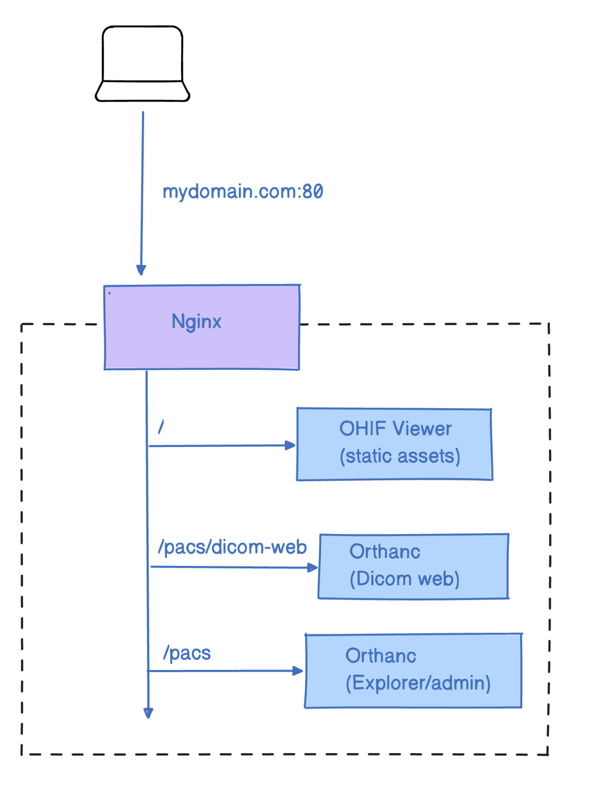

# Nginx + Image Archive


At a certain point, you may want others to have access to your instance of the
OHIF Viewer and its medical imaging data. This post covers one of many potential
setups that accomplish that. Please note, noticeably absent is user account
control.

Do not use this recipe to host sensitive medical data on the open web. Depending
on your company's policies, this may be an appropriate setup on an internal
network when protected with a server's basic authentication.


### Handling Web Requests

We mitigate our first issue by allowing [Nginx][nginx] to handle incoming web
requests. Nginx is open source software for web serving, reverse proxying,
caching, and more. It's designed for maximum performance and stability --
allowing us to more reliably serve content.

More specifically, we accomplish this by using a
[`reverse proxy`](https://en.wikipedia.org/wiki/Reverse_proxy) to retrieve
resources from our image archive (Orthanc), and when accessing its web admin.

> A reverse proxy is a type of proxy server that retrieves resources on behalf
> of a client from one or more servers. These resources are then returned to the
> client, appearing as if they originated from the proxy server itself.


This setup allows us to create a setup similar to the one pictured below:




- All web requests are routed through `nginx` image
- `/pacs/dicom-web` is a reverse proxy for `orthanc`'s `DICOM Web` endpoints, which handles DICOM requests
- `/pacs` is a reverse proxy for `orthanc`'s Web Admin, which is the UI for managing studies
- All static resources for OHIF Viewer are served up by `nginx` when a matching
  route for that resource is requested

## Getting Started

### Requirements

- Docker
  - [Docker for Mac](https://docs.docker.com/docker-for-mac/)
  - [Docker for Windows](https://docs.docker.com/docker-for-windows/)

_Not sure if you have `docker` installed already? Try running `docker --version`
in command prompt or terminal_

### Setup

- `cd platform/app/.recipes/Nginx-Orthanc`
- run: `docker-compose up --build`
- Navigate to `127.0.0.1` for the viewer (at first there is no study)
- Navigate to `127.0.0.1/pacs` for uploading studies via the UI, or send studies via DIMSE C-STORE to `ORTHANC@127.0.0.1:4242` (hint: you can use utilizes like dcm4che's `storescu` to send studies in bulk via the command line)

:::note
For subsequent runs, use `docker-compose up -d` to start the services without rebuilding the images. However, ensure you rebuild the images if you make changes to the Dockerfile. If you modify the configurations in the `nginx.conf` or `orthanc.json` files, you can restart the services by running `docker-compose up`, as these files are mounted as volumes.

```
Inside docker compose file you see the following volumes mounted:

volumes:
  # Nginx config
  - ./config/nginx.conf:/etc/nginx/nginx.conf
  # Logs
  - ./logs/nginx:/var/logs/nginx
```
:::


You can see the overview of the mentioned steps:


:::info
The following video demonstrates an outdated capture using the deprecated `OpenResty-Orthanc` recipe. However, it still provides insight into the steps for running the viewer with Orthanc. Use the new `Nginx-Orthanc` recipe for the most up-to-date instructions.
:::


<div style={{padding:"56.25% 0 0 0", position:"relative"}}>
    <iframe src="https://player.vimeo.com/video/843233827?badge=0&amp;autopause=0&amp;player_id=0&amp;app_id=58479"  frameBorder="0" allow="autoplay; fullscreen; picture-in-picture" allowFullScreen style= {{ position:"absolute",top:0,left:0,width:"100%",height:"100%"}} title="measurement-report"></iframe>
</div>


### Troubleshooting

_Exit code 137_

This means Docker ran out of memory. Open Docker Desktop, go to the `advanced`
tab, and increase the amount of Memory available.

_Cannot create container for service X_

Use this one with caution: `docker system prune`

_X is already running_

Stop running all containers:

- Win: `docker ps -a -q | ForEach { docker stop $_ }`
- Linux: `docker stop $(docker ps -a -q)`


_Traceback (most recent call last):_
  _File "urllib3/connectionpool.py", line 670, in urlopen_
  _...._

Are you sure your docker is running? see explanation [here](https://github.com/docker/compose/issues/7896)


### Configuration

After verifying that everything runs with default configuration values, you will
likely want to update:

- The domain: `http://127.0.0.1`

#### OHIF Viewer

The OHIF Viewer's configuration is imported from a static `.js` file. The
configuration we use is set to a specific file when we build the viewer, and
determined by the env variable: `APP_CONFIG`. You can see where we set its value
in the `dockerfile` for this solution:

`ENV APP_CONFIG=config/docker-nginx-orthanc.js`

You can find the configuration we're using here:
`/public/config/docker-nginx-orthanc.js`

To rebuild the `webapp` image created by our `dockerfile` after updating the
Viewer's configuration, you can run:

- `docker-compose build` OR
- `docker-compose up --build`

#### Other

All other files are found in: `/docker/Nginx-Orthanc/`

| Service           | Configuration                     | Docs                                        |
| ----------------- | --------------------------------- | ------------------------------------------- |
| OHIF Viewer       | [dockerfile][dockerfile]          | You're reading them now!                    |
| Nginx | [`/nginx.conf`][config-nginx]     |  |
| Orthanc           | [`/orthanc.json`][config-orthanc] | [Here][orthanc-docs]                        |

## Next Steps

### OHIF + Dcm4chee

You can follow the similar steps above to run OHIF Viewer with Dcm4chee PACS.

The recipe for this setup can be found at `platform/app/.recipes/Nginx-Dcm4chee`.


### Deploying to Production

While you can deploy this solution to production, there is one main caveat: every user can access the app and the patient portal without any authentication. In the next step, we will add authentication with Keycloak to secure the app.


### Improving This Guide

Here are some improvements this guide would benefit from, and that we would be
more than happy to accept Pull Requests for:

- Add Docker caching for faster builds


### Referenced Articles

For more documentation on the software we've chosen to use, you may find the
following resources helpful:

- [Orthanc for Docker](http://book.orthanc-server.com/users/docker.html)

For a different take on this setup, check out the repositories our community
members put together:

- [mjstealey/ohif-orthanc-dimse-docker](https://github.com/mjstealey/ohif-orthanc-dimse-docker)
- [trypag/ohif-orthanc-postgres-docker](https://github.com/trypag/ohif-orthanc-postgres-docker)

<!--
  Links
  -->

<!-- prettier-ignore-start -->
<!-- DOCS -->
[nginx]: https://www.nginx.com/resources/glossary/nginx/
[understanding-cors]: https://medium.com/@baphemot/understanding-cors-18ad6b478e2b
[orthanc-docs]: http://book.orthanc-server.com/users/configuration.html#configuration
[lua-resty-openidc-docs]: https://github.com/zmartzone/lua-resty-openidc
<!-- SRC -->
[dockerfile]: https://github.com/OHIF/Viewers/blob/master/platform/app/.recipes/OpenResty-Orthanc/dockerfile
[config-nginx]: https://github.com/OHIF/Viewers/blob/master/platform/app/.recipes/OpenResty-Orthanc/config/nginx.conf
[config-orthanc]: https://github.com/OHIF/Viewers/blob/master/platform/app/.recipes/OpenResty-Orthanc/config/orthanc.json
<!-- prettier-ignore-end -->
